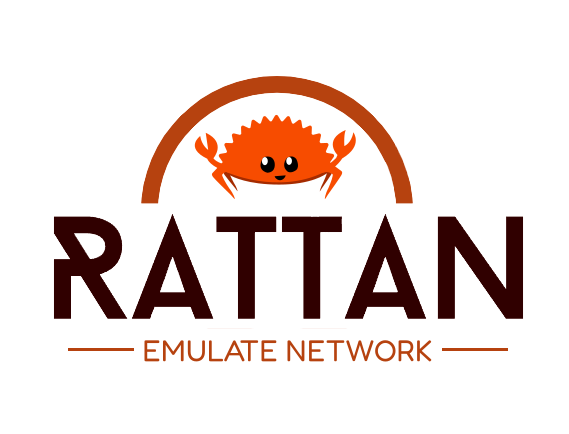

# [](https://rattan.stack.rs)

[](https://github.com/stack-rs/rattan/actions/workflows/ci.yml)

High Performance Modular Transport Channel Emulator Ready for Post-Gigabit Era.


## Development

## Flamegraph

```shell
cargo install flamegraph
cargo flamegraph --root --example channel
```