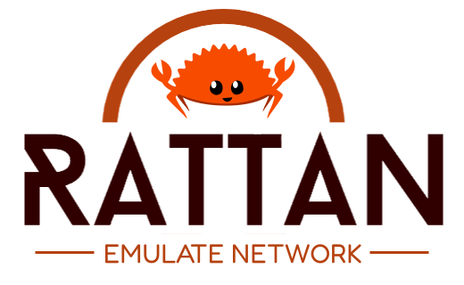

<div align="center">
  <h1>
    <a href="https://github.com/stack-rs/rattan"></a>
  </h1>
</div>

**Rattan** is an extensible and scalable Internet path emulator framework.

We provide a simple and easy-to-use API to create and manage network emulations. Rattan is designed to be used in a wide range of scenarios, from testing network applications to debugging complex network performance issues.

Our modular design makes it easy to extend **Rattan** with different network effects. We provide a set of built-in modules that can be used to emulate different network conditions, such as bandwidth, latency, packet loss, ISP policies and etc.

We support Linux only at the moment. Currently, kernel version v5.4, v5.15, v6.8, v6.10 and v6.12 are tested.

This branch is the artifact for the paper:

> **#2689 Rattan: An Extensible and Scalable Modular Internet Path Emulator.** *2026 USENIX Annual Technical Conference (USENIX ATC '26).*

See the [artifact guide](artifact/README.md) to get started.

## Project structure

```
artifact/               Everything to do with reproducing the paper
├── README.md             The guide: setup, experiments, reading results
├── setup-host.sh         Prepare the host
├── up.sh                 Create and provision one guest
├── Vagrantfile           Guest definitions, started through up.sh
├── scripts/              Installing Rattan, the baselines, the MPTCP kernel
├── microbench/           §5.1, Figures 5, 6 and 7
├── mptcp/                §5.2, Table 2
└── analyze/              Runs -> CSVs and figures

src/                    The `rattan` and `rattan-rv` command-line tools
rattan-core/            The emulator itself
├── src/cells/            One module per network effect: bandwidth, delay,
│                         loss, shadow, router, token bucket
├── src/core.rs           The runtime that executes a graph of cells
├── src/config/           The TOML a channel is described in
└── src/control/          Changing a running channel's parameters
rattan-env/             Network namespaces, veth pairs and RVNIC devices
rattan-log/             Structured logging of what a run did
rvnic/                  Rattan's virtual NIC: kernel module and user library

scripts/                Installing Rattan and cleaning up after it
config.example.toml     A commented example channel configuration
examples/               Running a server inside Rattan and forwarding a host
                        port to it
guide/                  The user guide (https://docs.stack.rs/rattan)
```

## Using Rattan outside the paper

Rattan is a general-purpose tool, not only the subject of these experiments. A channel is described in one TOML file and applied to any command:

```bash
rattan run --config config.example.toml -- iperf3 -c $RATTAN_BASE
```

The [User Guide](https://docs.stack.rs/rattan) covers the cells, the configuration format, and using Rattan as a Rust library.

## License

Apache License 2.0. See [LICENSE](LICENSE).

## Contributing

Rattan is free and open source. You can find the source code on [GitHub](https://github.com/stack-rs/rattan) and issues and feature requests can be posted on the [GitHub issue tracker](https://github.com/stack-rs/rattan/issues). Rattan relies on the community to fix bugs and add features: if you'd like to contribute, please read the [CONTRIBUTING](https://github.com/stack-rs/rattan/blob/master/CONTRIBUTING.md) guide and consider opening a [pull request](https://github.com/stack-rs/rattan/pulls).
