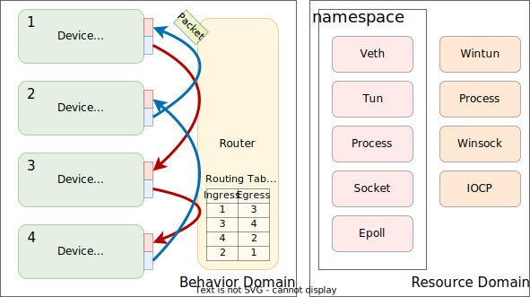
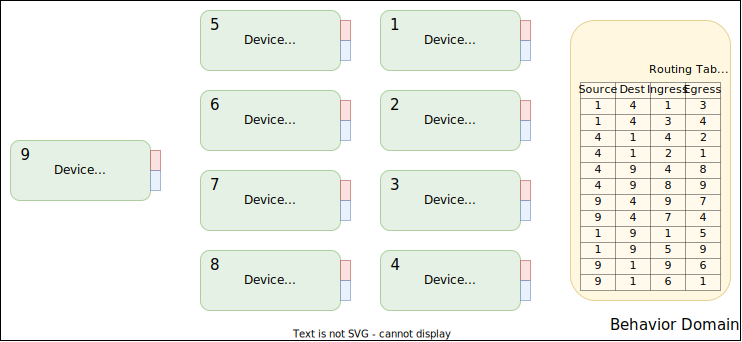
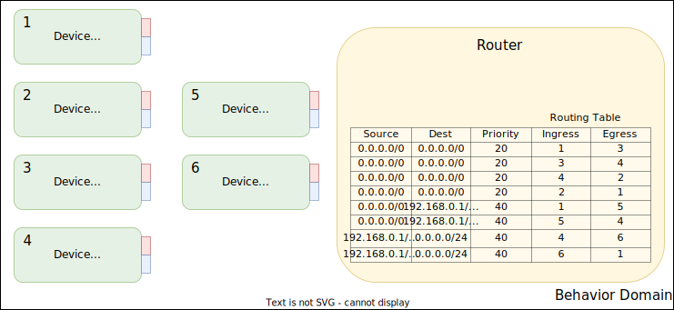
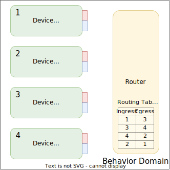

# Ratten Design Overview

## Summary

Ratten is a modular network emulation tool for networking tests and evaluation. It has a command-line tool for quickly creating popular emulated channels and a library that offers reusable components for channel emulations.

We highlight some design targets for Ratten:

* **Modular**: Rattan is fully-modularized thanks to rust's powerful trait system. Any building block in Ratten has a clear public interface and is easily replaceable.
* **Efficient**: Ratten actively leverages optimization strategies like compile-time computations and novel operating system interfaces to maintain high efficiency.
* **Multi-platform**: Rattan is designed to support a variety of platforms. (currently, only Linux and Windows are actively developed, and Linux is the first priority).

## Architecture

### Device

Ratten's central component is a router that continuously transfers packets between various devices. Devices can be physical interfaces, virtual interfaces (TUN device and the device, for example), and software queues that impose artificial latency and bandwidth limitations to emulate desired network characterizations. It could also be any software or hardware piece that supports packet sending and receiving for more general features like logging, recording, measuring, and monitoring. A particular routing table directs the router on how to forward packets.

We could create powerful emulated channels with flexible combinations of rich devices. For example, we can:

* Emulate a channel with three interfaces and varying bandwidths in each direction.

* Emulate a QoS-capable channel that restricts the bandwidth for traffic to a particular destination address.

* Establish a hybrid channel by coupling a physical link with an emulated channel that randomly drops packets.

    

### Router

The router may work in two modes: busy-loop and event-driven; both require device support. In busy-loop mode, the router polls every device in an unending loop and promptly handles incoming packets. In event-driven mode, the router awaits packet events and forwards packets on demand. It utilizes an external poller supported by all devices for event polling. The busy loop mode gives lower latency at the cost of higher CPU utilization, a necessary evil for high-resolution emulation.

The router is indifferent to internal states and hardware resources used by devices.
It is a single-thread program for simplicity as it's unlikely to be CPU-bound in most cases. Devices (especially queues) can run a background thread (or process, if necessary) to handle internal work and creates a trivial `read()/write()` implementation, easing the burden of the router thread in the remaining cases.

### Resource

We intentionally decouple logic components (device, router, etc.) and hardware/software resources backing them provided by the operating system (`veth` device, process, etc.). It's essential for multi-platform support so one logic component can be backed by different OS resources on different platforms. It also helps when we need multiple logical components for one OS resource. One example is writing one device using the `AF_XDP` interface and another using the conventional raw socket interface for the `veth` virtual interface.

In platforms with isolation mechanisms (cgroup and namespace on Linux, jail on BSD, etc.), we implement platform-specific isolators to isolate these physical resources for better stability.
